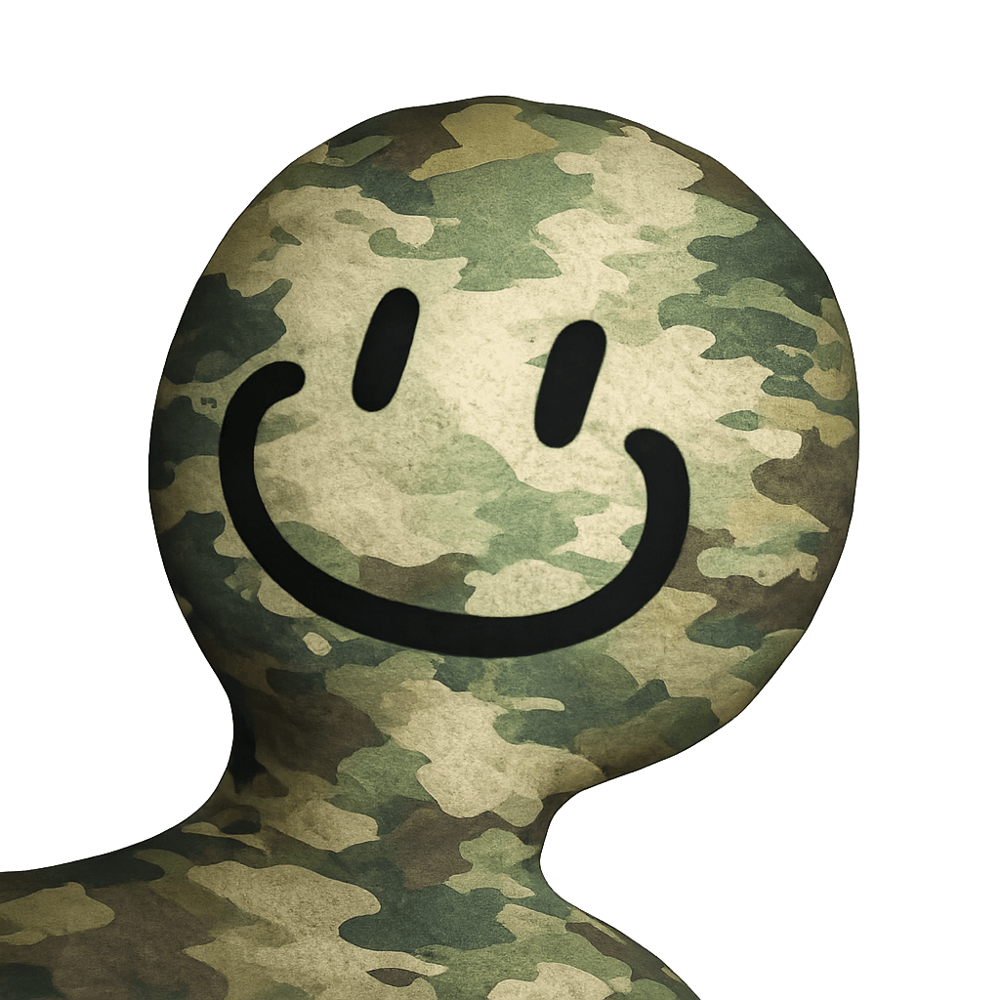

<p align="center">
  
</p>

# 🦎 Meccha Chameleon Save Editor

Edit your Meccha Chameleon save file directly in your browser.

No install. No account. No upload. Open your save, change the values, and download the patched save file.

## 🚀 Use the app

👉 https://meccha-chameleon-save-editor.vercel.app/

## ✨ What you can edit

- ❤️ Likes received
- 🔎 Players found

## 🕹️ How to use

1. 🌐 Open Meccha Chameleon and stay on the main page.
2. 🌐 Open the app:

```text
https://meccha-chameleon-save-editor.vercel.app/
```

3. ⌨️ Press **Win + R**.
4. 📁 Paste this folder path:

```text
%LOCALAPPDATA%\Chameleon\Saved\SaveGames
```

5. 🦎 Select the save file that starts with **cLeon_Default_** and ends with **.sav**.
6. 📤 Drag the save file onto the editor, or click the upload box and choose it manually.
7. ✏️ Change likes received or players found.
8. 🛟 Click **Download backup** to keep a copy of the original.
9. 💾 Click **Download edited save**.
10. ✅ Replace the file inside **SaveGames** with the downloaded file.
11. 🎯 In the game, join a match as hunter and find at least one hider so the game saves the patched values.

## ⚠️ Notes

- 🔒 Your save is edited in your browser.
- 🛟 Keep a backup before replacing your save.
- ☁️ Staying on the main page lets the game finish cloud download first. After patching, finding a hider forces the game to save the patched local file.
- 🚫 Direct browser saving may be blocked because the save is inside `%LOCALAPPDATA%`, so this editor uses the safer download-and-replace method.

## See also

- [Meccha Chameleon Atlas](https://mecchachameleon.art/) — Fan-maintained hide-spots reference, paint-match notes, and seeker counter-tips for the paint-based hide-and-seek game Meccha Chameleon. Unofficial, not affiliated with the developer.
